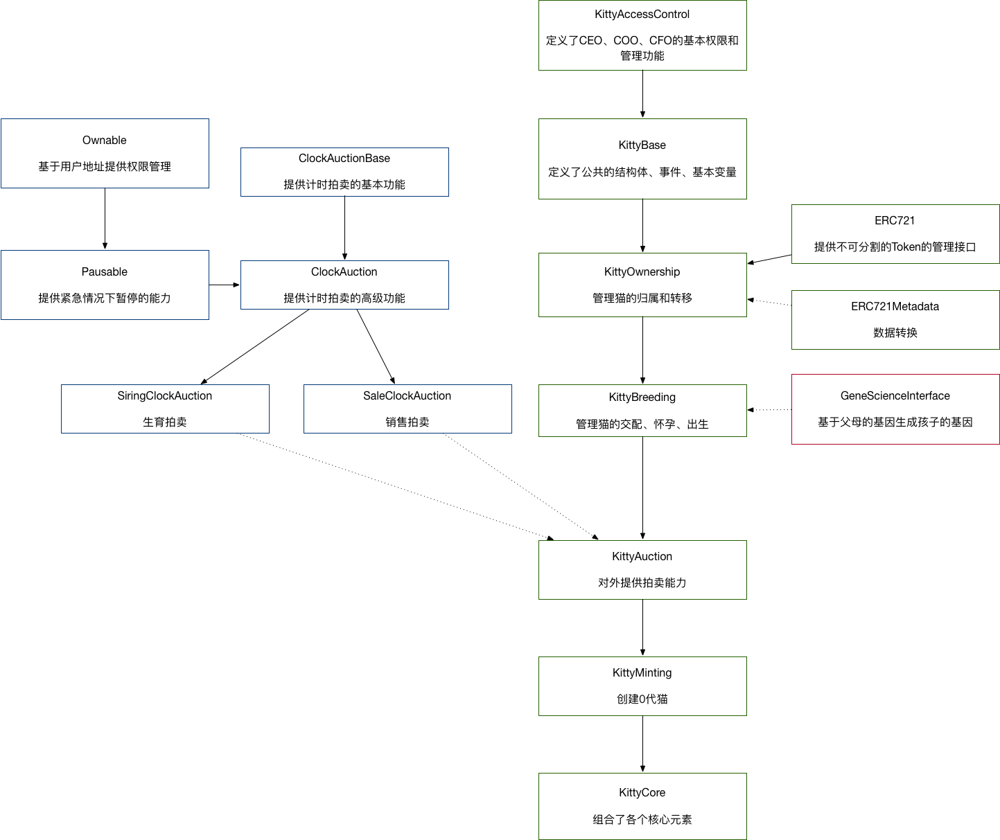

# 实现CryptoKitties谜恋猫

### 基本玩法

在平台中你可以使用ETH购买、繁衍、拍卖迷恋猫。

## 区块链开发

### 基本规则

- 非兄妹父母关系的两只猫可以生育
- 两只猫可以来自同一个主人，或者一只猫被她的拥有者提供服务
- 任何一只都可以做父亲（father）或者母亲（mother）
- 猫没有性别
- 交配后，母亲会怀孕，并且进入修养期；父亲也同样会进入修养期
- 修养期内不能再次剩余，修养期会随着生育次数而增长
- 母亲的修养期结束后，会生出小猫，并且可以再次生育
- 主人可以选择拍卖猫或者赠送猫


### 核心流程

1. COO每隔15分钟产生一个0代的猫，并进行拍卖（Main `createGen0Auction()`）
1. 用户可以购买0代猫（Sale Auction `bid()`）
1. 用户可以查询猫的数据（Main `getKitty()`）
1. 用户可以自己繁衍猫（Main `breedWith()` or `breedWithAuto()`）
1. 修养期后，用户可以得到新的猫（Main `giveBirth()`）
1. 用户可以把一只猫作为父亲，拍卖他的生育服务（Main `createSiringAuction()`）
1. 用户把一只猫作为父亲，为某个以太坊地址提供生育服务（Main `approveSiring()`）
1. 用户可以购买一只猫的生育服务（Main `createSiringAuction()`）
1. 用户可以拍卖他的猫（Main `createSaleAuction()`）
1. 用户可以购买被拍卖的猫（Sale Auction `bid()`）
1. 用户可以查看被拍卖猫的信息（Sale/Siring Auction `getAuction()`）
1. 用户能够取消拍卖（Sale/Siring Auction `cancelAuction()`）
1. 用户能够赠送猫（Main `transfer()`）
1. 用户能够指定另一个用户能够获得他的猫的权限（Main `approve()`）
1. 用户可以认领自己被指定获得权限的猫（Main `transferFrom()`）
1. 只有CEO能够替换COO或者CTO（Main `setCEO()` `setCFO()` `setCOO()`）
1. COO能够创建和操作特殊的猫（Main `createPromoKitty()`）
1. COO能够转移拍卖的收入（Main `withdrawAuctionBalances()`）
1. CFO能够转移主协议的收益（Main `withdrawBalance()`）


#### 基因遗传


```python

def mixGenes(mGenes[48], sGenes[48], babyGenes[48]):
  # PARENT GENE SWAPPING
  for (i = 0; i < 12; i++):
    index = 4 * i
    for (j = 3; j > 0; j--):
      if random() < 0.25:
        swap(mGenes, index+j, index+j-1)
      if random() < 0.25:
        swap(sGenes, index+j, index+j-1)
  # BABY GENES
  for (i = 0; i < 48; i++):
    mutation = 0
    # CHECK MUTATION
    if i % 4 == 0:
      gene1 = mGene[i]
      gene2 = sGene[i]
      if gene1 > gene2:
        gene1, gene2 = gene2, gene1
      if (gene2 - gene1) == 1 and iseven(gene1):
        probability = 0.25
        if gene1 > 23:
          probability /= 2
        if random() < probability:
          mutation = (gene1 / 2) + 16
    # GIVE BABY GENES
    if mutation:
      baby[i] = mutation
    else:
      if random() < 0.5:
        babyGenes[i] = mGene[i]
      else:
        babyGenes[i] = sGene[i]

```

（来源：[CryptoKitties mixGenes Function](https://medium.com/@sean.soria/cryptokitties-mixgenes-function-69207883fc80)）

基因遗传的具体算法并没有被公开，但是很多牛人基于推断得到了上述的伪码。简单来说，分为三步：
1. 双亲的基因基于75%的概率进行轮转，从而有可能让隐性性状便成了显性性状
2. 当双亲的基因相差1的时候，有一定概率会进行变异，产生新的性状
3. 如果没有发生变异，各有50%的概率从双亲继承一段基因


### 核心协议
迷恋猫的协议关系如下图。



在整个结构中分成三条线
- 中间的主线，定义了迷恋猫的各个核心操作。为了拆解简化，有多个contract完成各自的任务，同时通过协议继承继承了整个关系
- 左侧的拍卖线，提供了单独的拍卖协议能力
- 右侧的基因线，仅仅提供新猫基因生成的功能；这样做能够部分实现基因算法的加密，但是也很快被人逆向工程了
